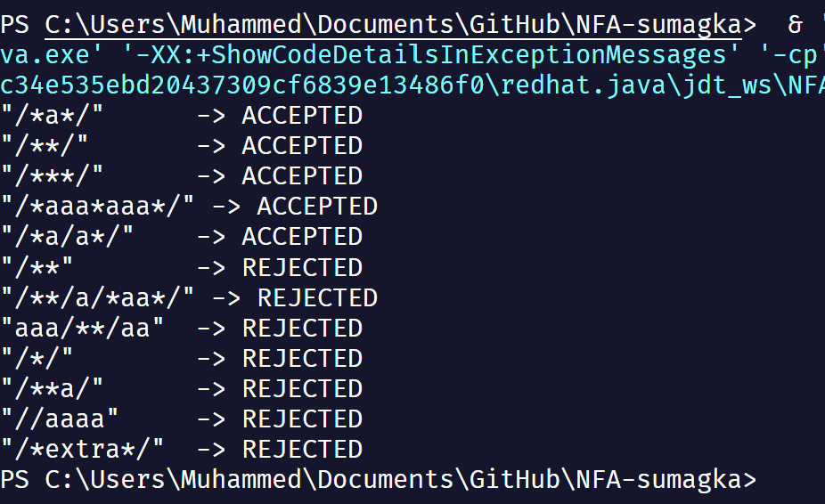
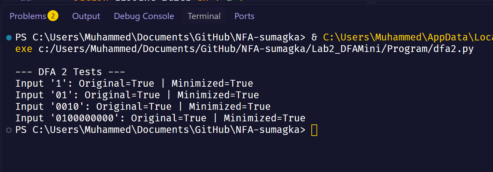
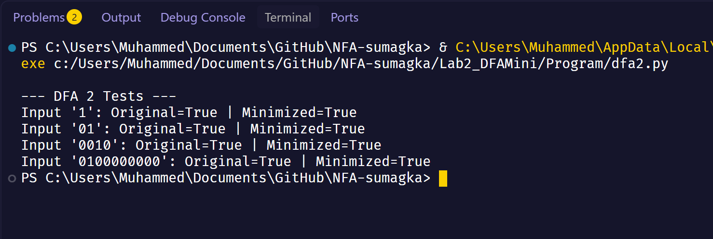
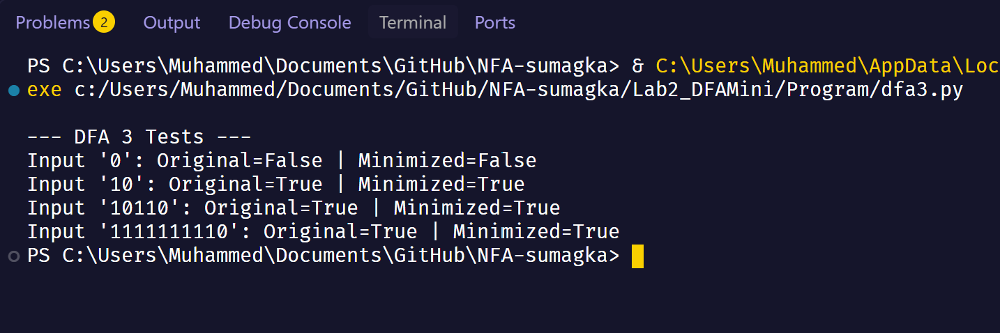
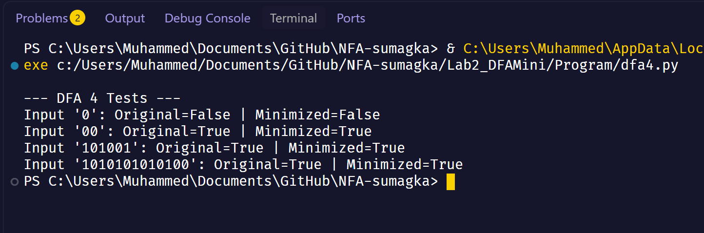

# CS13a: Automata Theory & Formal Language

This repository contains a compilation of my laboratory activity submissions for the course CS13a: Automata Theory & Formal Language.

## Student Information

- **Name:** Muhammed Shariff U. Sumagka
- **Program & Section:** 3 BSCS - A
- **Instructor:** Joseph C. Lorilla

## Laboratory Activity 1: NFA C-Style Comment Recognizer

This activity involves the design and implementation of a Non-Deterministic Finite Automaton (NFA) to recognize and validate C-style block comments (i.e., strings beginning with `/*` and ending with `*/`). The logic for this automaton was implemented using Java.

### Written Output

Below is the documentation detailing the state transition tables and NFA diagram for the program.

### Program Output

The following screenshot demonstrates the terminal execution of the Java code.

## Laboratory Activity 2: DFA Minimization

### Written Outputs (DFA 3 & 4)

Below is the documentation detailing the initial state transition tables, the equivalence partitioning minimization processes, and the final minimized DFA diagrams for DFA 3 (Ends with "10") and DFA 4 (Contains "00").

### Program Outputs

The following screenshots demonstrate the terminal execution of the Python scripts, comparing the boolean outputs of both the original and minimized DFA logic for various test strings.

#### DFA 1 (Sir Josh's Example 1)

#### DFA 2 (Sir Josh's Example 2)

#### DFA 3 (Example 3: Ends with "10")

#### DFA 4 (Example 4: Contains "00")

